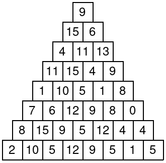

# Xor Pyramid 

Consider a xor pyramid where each number is the xor of lower-left and lower-right numbers. Here is an example pyramid:



Given the bottom row of the pyramid, your task is to find the topmost number.
## Input
- The first input line has an integer ```n```: the size of the pyramid.
The next line has ```n``` integers ```a_1,a_2,\dots,a_n```: the bottom row of the pyramid.
## Output
- Print one integer: the topmost number.
## Constraints

- ```1 \le n \le 2 \cdot 10^5```
- ```1 \le a_i \le 10^9```

## Example
Input:
```
8
2 10 5 12 9 5 1 5
```

Output:
```
9
```
