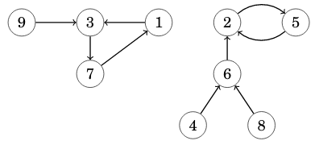

# Functional Graph Distribution 

A functional graph is a directed graph where each node has outdegree ```1```. For example, here is a functional graph that has ```9``` nodes and ```2``` components:



Given ```n```, your task is to calculate for each ```k=1 \dots n``` the number of functional graphs that have ```n``` nodes and ```k``` components.
## Input
- The only input line has an integer ```n```: the number of nodes.
## Output
- Print ```n``` lines: for each ```k=1 \dots n``` the number of graphs modulo ```10^9+7```.
## Constraints

- ```1 \le n \le 5000```

## Example
Input:
```
3
```

Output:
```
17
9
1
```
